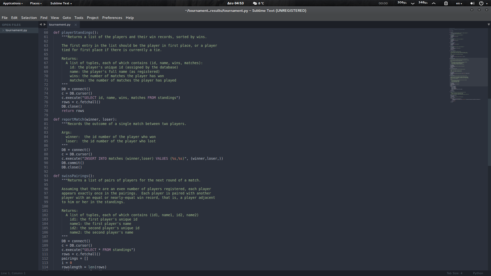

# Tournament Results

Python module that uses PostgreSQL database to keep track of players and matches in a swiss style game tournament.

The game tournament will use the Swiss system for pairing up players in each round: players are not eliminated, and each player should be paired with another player with the same number of wins, or as close as possible.

## Git, VirtualBox & Vagrant

Install the tools below for your operating system.

1. Install [Git](https://git-scm.com/downloads) (Git is a version control system)
2. Install [VirtualBox](https://www.virtualbox.org/wiki/Downloads) (VirtualBox is the software that runs the virtual machine)
3. Install [Vagrant](https://www.vagrantup.com/downloads) (Vagrant is the software that configures the virtual machine)

Once you are sure that everything is installed and working open a terminal and clone the following repository from Github in your PC:

`https://github.com/udacity/fullstack-nanodegree-vm`

You can do this using a terminal and the following command:

`git clone https://github.com/udacity/fullstack-nanodegree-vm`

Then browse to your folder where tournament is located, open a terminal and issue the following commands:

`vagrant up`

Once **vagrant up** has finished loading type the following (Opens an SSH connection):

`vagrant ssh`

Then you'll see something like this:

`vagrant@vagrant-ubuntu-trusty-32:~$`

Finally browse to the folder where tournament is located by typing the following:

`cd /vagrant/tournament`

## Build the database

To view the database first you need to import it.

Open a PostgreSQL session (while you are in the Vagrant machine):

`psql`

Then import the database by typing:

`\i tournament.sql`

Finally you can issue your SQL queries.

For example:

`SELECT * FROM players;`

To **exit** psql, type **\q** or **CTRL+D**

## Test
While you are inside the tournament folder in the Vagrant machine run:

`python tournament_test.py`

If you see the following then all the tests have passed and the code runs successfully.

1. Old matches can be deleted.
2. Player records can be deleted.
3. After deleting, countPlayers() returns zero.
4. After registering a player, countPlayers() returns 1.
5. Players can be registered and deleted.
6. Newly registered players appear in the standings with no matches.
7. After a match, players have updated standings.
8. After one match, players with one win are paired.
9. No players have any rematches.
Success!  All tests pass!
